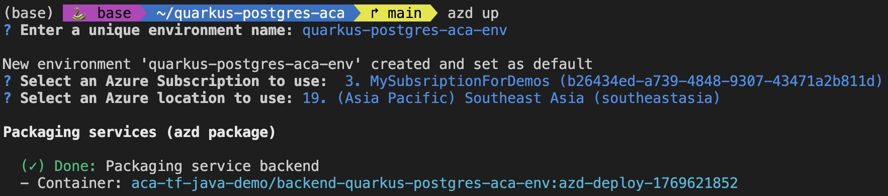

# Quarkus PostgreSQL on Azure Container Apps

A Quarkus application for todo management, deployed to Azure Container Apps with PostgreSQL database. Features Infrastructure as Code (IaC) with Terraform and streamlined deployment via Azure Developer CLI.

## Features

- **RESTful API**: Quarkus-based todo management system with full CRUD operations
- **Database**: Azure Database for PostgreSQL Flexible Server with Hibernate ORM Panache
- **Container Orchestration**: Azure Container Apps with auto-scaling capabilities
- **Infrastructure as Code**: Terraform modules for reproducible infrastructure
- **Java 21**: Modern Java runtime with Quarkus 3.18.4 framework
- **Native Compilation**: Support for GraalVM native image builds

## Architecture


### High-Level Components

1. **Azure Container Apps**: Hosts the Quarkus application with auto-scaling
2. **Azure PostgreSQL Flexible Server**: Managed database with automated backups
3. **Azure Container Registry**: Private registry for Docker images

### Application Structure

```
src/backend/
├── src/main/java/com/example/demo/
│   ├── TodoResource.java    # REST API endpoints
│   └── Todo.java            # JPA entity with Panache
├── src/main/resources/
│   └── application.properties   # Quarkus configuration
├── pom.xml                  # Maven dependencies
└── Dockerfile               # Container image definition

infra/
├── main.tf              # Root Terraform module
└── modules/
    ├── postgresql/      # PostgreSQL Flexible Server
    ├── container-apps/  # Container Apps environment
    ├── container-registry/  # Azure Container Registry
    └── resource-group/  # Resource group
```

**Architecture Pattern**: Active Record pattern with Quarkus Panache:

- API Layer ([TodoResource.java](src/backend/src/main/java/com/example/demo/TodoResource.java)) → Entity Layer ([Todo.java](src/backend/src/main/java/com/example/demo/Todo.java))

## Prerequisites

> This template will create infrastructure and deploy code to Azure. If you don't have an Azure Subscription, you can sign up for a [free account here](https://azure.microsoft.com/free/). Make sure you have contributor role to the Azure subscription.

### Required Tools

- [Azure Developer CLI](https://aka.ms/azd-install) (v1.5.0+)
- [Terraform CLI](https://aka.ms/azure-dev/terraform-install) (v1.5.0+)
- [Azure CLI](https://learn.microsoft.com/cli/azure/install-azure-cli)
- [Docker](https://docs.docker.com/get-docker/)

## Quick Start

### Deploy to Azure

The fastest way to get started is using Azure Developer CLI:

```bash
# Clone the repository
git clone <repository-url>
cd quarkus-postgres-aca

# Login to Azure
azd auth login

# Provision infrastructure and deploy application
azd up
```

This command will:

1. Prompt for environment name, subscription, and Azure region
2. Create all required Azure resources via Terraform
3. Build and push the Docker image to Azure Container Registry
4. Deploy the container to Azure Container Apps



Once complete, you'll see the provisioned resources and the application URL:


## API Endpoints

### Available Endpoints

| Method | Endpoint          | Description         |
| ------ | ----------------- | ------------------- |
| POST   | `/api/todos`      | Create a new todo   |
| GET    | `/api/todos`      | List all todos      |
| GET    | `/api/todos/{id}` | Get todo by ID      |
| PUT    | `/api/todos/{id}` | Update todo details |
| DELETE | `/api/todos/{id}` | Delete a todo       |

## Destroy Resources

```bash
# Remove all Azure resources
azd down
```

## Contributing

1. Fork the repository
2. Create a feature branch (`git checkout -b feature/amazing-feature`)
3. Commit your changes (`git commit -m 'Add amazing feature'`)
4. Push to the branch (`git push origin feature/amazing-feature`)
5. Open a Pull Request

## Additional Resources

- [Quarkus Documentation](https://quarkus.io/guides/)
- [Quarkus Hibernate ORM Panache](https://quarkus.io/guides/hibernate-orm-panache)
- [Azure Container Apps Documentation](https://learn.microsoft.com/azure/container-apps/)
- [Azure PostgreSQL Flexible Server](https://learn.microsoft.com/azure/postgresql/flexible-server/)
- [Terraform Azure Provider](https://registry.terraform.io/providers/hashicorp/azurerm/latest/docs)

## License

This project is licensed under the MIT License - see the LICENSE file for details.
